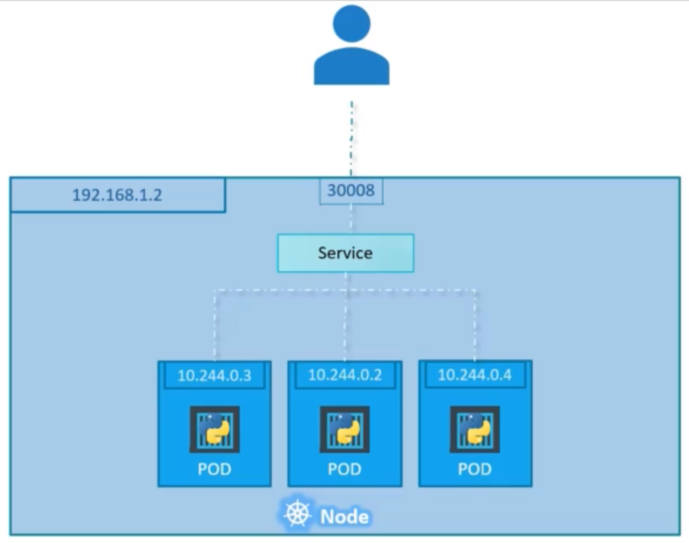
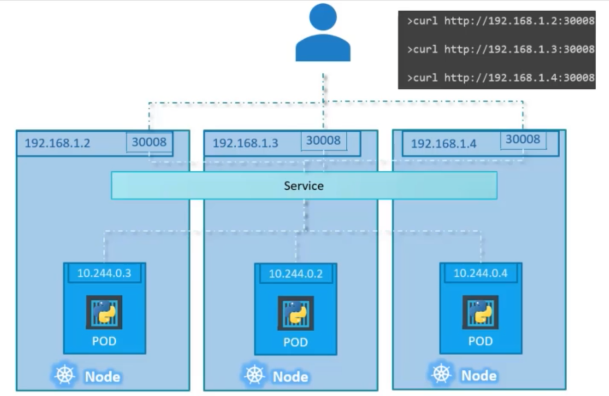
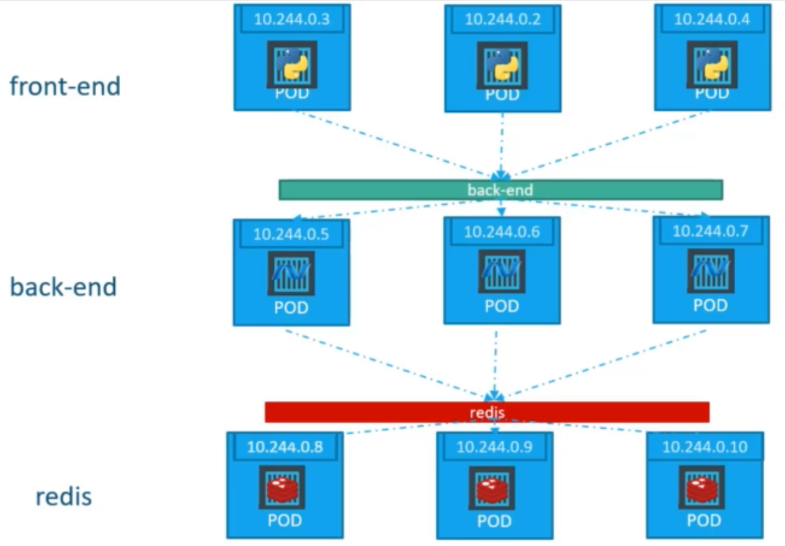

# Kubernetes

## YAML in Kubernetes

__Standard Template:__

```yaml
apiVersion: v1
kind:
metadata:
  name:
  labels:

spec:


```

- `apiVersion` and `kind` are String
- `metadata` is a dictionary
- `kind` defines the type of the resource

__Creating resource with YAML:__

```bash
kubectl create -f resource-definition.yaml
```

## Pod

Pods are the smallest unit in Kubernetes cluster which usually contain and run a single container but there can also be multi-container pods (helper containers).

__Running a Container:__

```bash
➜  notes git:(master) ✗ kubectl run nginx --image nginx
pod/nginx created
```

- image name is the docker image name (if kubernetes cluster container backend is docker).

__Getting Pods:__

```bash
➜  notes git:(master) ✗ kubectl get pods
NAME    READY   STATUS    RESTARTS   AGE
nginx   1/1     Running   0          7s
```

- 1/1 means 1 out of 1 containers is available and ready

__Describing Pods:__

```bash
➜  notes git:(master) ✗ kubectl describe pod nginx
Name:         nginx
Namespace:    default
Priority:     0
Node:         docker-desktop/192.168.65.4
Start Time:   Sat, 08 Jan 2022 18:03:26 +0530
Labels:       run=nginx
Annotations:  <none>
Status:       Running
IP:           10.1.0.147
IPs:
  IP:  10.1.0.147
Containers:
  nginx:
    Container ID:   docker://66faa22bb05f77c07b51f1edf45ac207f3e4c3899390ef971223792754a8a059
    Image:          nginx
    Image ID:       docker-pullable://nginx@sha256:0d17b565c37bcbd895e9d92315a05c1c3c9a29f762b011a10c54a66cd53c9b31
    Port:           <none>
    Host Port:      <none>
    State:          Running
      Started:      Sat, 08 Jan 2022 18:03:31 +0530
    Ready:          True
    Restart Count:  0
    Environment:    <none>
    Mounts:
      /var/run/secrets/kubernetes.io/serviceaccount from kube-api-access-dn6w2 (ro)
Conditions:
  Type              Status
  Initialized       True
  Ready             True
  ContainersReady   True
  PodScheduled      True
Volumes:
  kube-api-access-dn6w2:
    Type:                    Projected (a volume that contains injected data from multiple sources)
    TokenExpirationSeconds:  3607
    ConfigMapName:           kube-root-ca.crt
    ConfigMapOptional:       <nil>
    DownwardAPI:             true
QoS Class:                   BestEffort
Node-Selectors:              <none>
Tolerations:                 node.kubernetes.io/not-ready:NoExecute op=Exists for 300s
                             node.kubernetes.io/unreachable:NoExecute op=Exists for 300s
Events:
  Type    Reason     Age   From               Message
  ----    ------     ----  ----               -------
  Normal  Scheduled  27s   default-scheduler  Successfully assigned default/nginx to docker-desktop
  Normal  Pulling    26s   kubelet            Pulling image "nginx"
  Normal  Pulled     22s   kubelet            Successfully pulled image "nginx" in 3.7617608s
  Normal  Created    22s   kubelet            Created container nginx
  Normal  Started    22s   kubelet            Started container nginx
```

__Getting Pods in "wide" format:__

```bash
➜  notes git:(master) ✗ kubectl get pods -o wide
NAME    READY   STATUS    RESTARTS   AGE     IP           NODE             NOMINATED NODE   READINESS GATES
nginx   1/1     Running   0          2m48s   10.1.0.147   docker-desktop   <none>           <none>
```

__Creating Pod using YAML:__

pod-definition.yaml

```YAML
apiVersion: v1
kind: Pod
metadata:
  name: myapp-pod
  labels:
    app: myapp
    type: frontend
spec:
  containers:
    - name: nginx-container
      image: nginx
```

- `containers` is an array

__Using environment variables in a Container:__

```YAML
...
...
spec:
  containers:
    - name: postgres
      image: postgres
      env:
        - name: POSTGRES_PASSWD
          value: mysecretpassword
```

- There are better ways to store the "sensitive" data like passwords. e.g., `Secrets`

__Creating a Pod Description File from Command line:__

```bash
kubectl run redis --image=redis123 --dry-run=client -o yaml > pod.yaml
```

__Editing Pod on the Fly:__

```bash
kubectl edit pod redis
```

- This will open a pod-description file as YAML inside VIM in the terminal

## ReplicationControllers and ReplicaSets

- Maintains HA with required number of pods (within a node or cluster)
- Provides Load balancing and scalability

### ReplicationController (`deprecated`) Definition

```yaml
apiVersion: v1
kind: ReplicationController
metadata:
  name: myapp-rc
  labels:
    app: myapp
    type: frontend
spec:
  template:
    <POD-SPEC-WITHOUT-VERSION-AND-METADATA>
  replicas: 3  # number of required replicas
```

- 3 Pods will be created (and maintained) with `myapp-rc-` prefix
- `RepliationController` api is deprecated

### ReplicaSet Definition (similar to RC)

```yaml
apiVersion: apps/v1   # Difference
kind: ReplicaSet
metadata:
  name: myapp-replicaset
  labels:
    app: myapp
    type: frontend
spec:
  template:
    <POD-SPEC-WITHOUT-VERSION-AND-METADATA>
  replicas: 3
  selector:           # Difference
    matchLabels:
      type: frontend
```

- 3 Pods will be created (and maintained) with `myapp-replicaset-` prefix
- Additional `selector.matchLabels` to identify which Pods to apply changes to (or scale down to).

__Scaling ReplicaSet:__

```bash
# after update replicas in the definition file
kubectl replace -f replicaset-definition.yaml
```

```bash
kubectl scale --replicas=6 -f replicaset-definition.yaml
```

```bash
kubectl scale --replicas=6 replicaset myapp-replicaset
#                          ^ type     ^ name
```

__Deleting ReplicaSet:___

```bash
kubectl delete replicaset myapp-replicaset
```

- Also deletes all underlying pods

## Service

- External Access to the App
- Load balancing
- 2 Types
  - __NodePort__
  - __ClusterIP__

### NodePort

NodePort Service in single Node



NodePort Service in multi-node Cluster



### ClusterIP



service-definition.yaml

```yaml
apiVersion: v1
kind: Service
metadata:
  name: backend

spec:
  type: ClusterIP
  ports:
    - targetPort: 80
      port: 80

    selector:
      app: myapp
      type: backend
```
