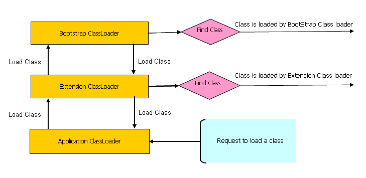

# Java - Misc

## Strings

- String pool was used to be in Permgen, but __since java 8 it has been moved to main heap area__.
- Since java 1.7 `+` operators are implemented using `StringBuilder`'s `.append()` method.
- `.concat()` can only concat 2 strings (unlike `.append()` and `+` which can concat different data types)
- __There was a memory leak in java 1.6 `String()` constructor.__
- Regex - match introduced in java 8.

## Stream

- The data comes from elsewhere (a collection, array, generator function, or I/O channel) and is processed through a pipeline of computational steps to produce a result or side effect, at which point the stream is finished.
- Stream's __focus is on computation__, __not data__.
- Streams provide __no storage for the elements that they process__*, and the lifecycle of a stream is more like a point in time — the invocation of the terminal operation.
- For streams, __only the terminal operation is eager, all the others are lazy__.
- Stream operations represent a functional transformation on their input (also a stream), rather than a mutative operation on a data set (filtering a stream produces a new stream whose elements are a subset of the input stream but doesn't remove any elements from the source).

Example of non-stream vs stream operation:

```java
//Ad-hoc query over a collection

Set<Seller> sellers = new HashSet<>();
for (Txn t : txns) {
  if (t.getBuyer().getAge() >= 65)
    sellers.add(t.getSeller());
}

List<Seller> sorted = new ArrayList<>(sellers);

Collections.sort(sorted, new Comparator<Seller>() {
  public int compare(Seller a, Seller b) {
    return a.getName().compareTo(b.getName());
  }
});

for (Seller s : sorted)
  System.out.println(s.getName());
```

```java
txns.stream()
  .filter(t -> t.getBuyer().getAge() >= 65)
  .map(Txn::getSeller)
  .distinct()
  .sorted(comparing(Seller::getName))
  .map(Seller::getName)
  .forEach(System.out::println);
```

Key Advantages:

1. No distraction of garbage variable (sellers, sorted in the above example)
2. Don't have to keep track of context which leads to code understanding on one glance, less error prone.

## ClassLoader

__javac__ : `*.java` files to `*.class` files

__Class-loader__ : loads the `*.class` files!

Kinds of class loaders and load from locations:

1. __Bootstrap__ (or "Primordial ClassLoader")
    1. `JRE/lib/rt.jar`
2. __Extension__
    1. `JRE/lib/ext`
    2. Or any directory denoted by : `"java.ext.dirs"`
3. System or Application
    1. `"CLASSPATH"` environment variable.
    2. `"-classmate"` or "-cp" option.
    3. Classpath attribute of manifest inside JAR file.

### Bootstrap ClassLoader

- Loads standard JDK class files from "rt.jar"
- Parent of all class loaders
- Doesn't have any parent
  - `String.class.getClassLoader() == null`
- Only class loader which is __implemented in native language__, mostly in "C" !
  - __All others are implemented using `java.lang.ClassLoader`__

### Extension ClassLoader

- Delegates class loading request to its parent (Bootstrap)
- If unsuccessful from parent (Bootstrap), it loads class from `"jre/lib/ext"` or any directory pointed by `"java.ext.dirs"`
- Implemented by : `sun.misc.Launcher$ExtClassLoader`
- Child or Extension class loader



Principles:

1. Delegation principle: A class in loaded in Java when it is needed.
2. Visibility principle: Child ClassLoader can see class loaded by parent ClassLoader, but the vice-versa is not true.

Simple test to prove visibility principle

- Get Current class's ClassLoader by calling, `Abc.class.getClassLoader()` ====> Abc is an Application ClassLoader class
- If we try to load this class using the Extension class loader like:
  - `Class.forName("somepack.Abc", true, ClassLoaderTest.class.getClassLoader().getParent())`
  - This will fail! =====> meaning extension class loader cannot see the classes loaded by application class loader

Extras:

- Class is loaded by calling `loadClass()` method of `java.lang.ClassLoader` class which calls `findClass()` method to locate bytecodes for the corresponding class
- Extension ClassLoader uses `java.net.URLClassLoader` which searches for class files and resources in JAR and directories. any search path which is ended using "/" is considered a directory
- If `findClass()` does not found the class than it throws `java.lang.ClassNotFoundException` and if it finds it calls defineClass() to convert bytecodes into a `.class` instance which is returned to the caller
