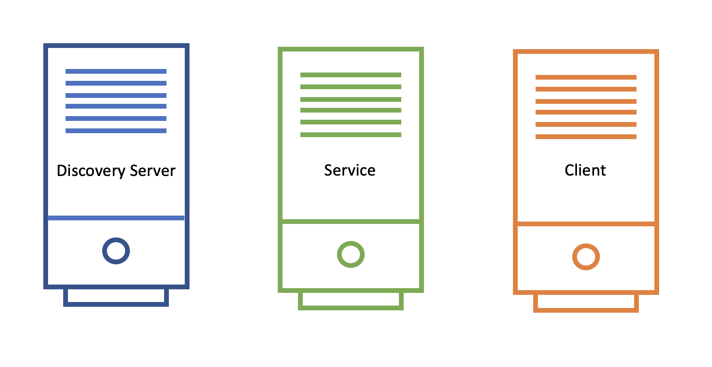
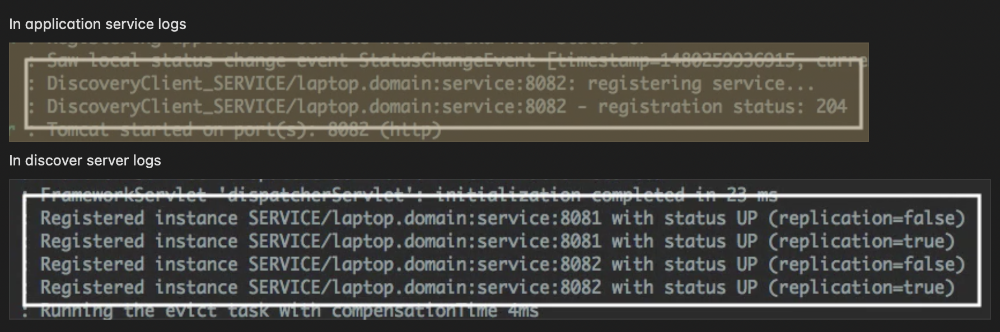

# Spring Cloud Fundamentals: Service Discovery

__Question:__ In microservice environment, how does one service know where the other service is located at?

Service discovery provides:

- A way for a service to __register itself__.
- A way for a service to __de-register itself__.
- A way for a client to __find other services__.
- A way to __check the health of a service__ and remove unhealthy instances.

Multiple ways to discover services in Spring Cloud:

- __Spring Cloud Consul__
- __Spring Cloud Zookeeper__
- __Spring Cloud Netflix__

## Service Discovery Key Components



## Service Discovery Flow


1. Service Registers
2. Client looks up service location
3. Discovery server sends back service location
4. Client-Service connection is established.

## Service Discovery Components: Discovery Server

- An actively managed registry for service locations.
- Source of truth.
- One or more instances.

### Using Spring Cloud Eureka Server

pom.xml

```xml
<dependencyManagement>
  <dependencies>
    <dependency>
      <groupId>org.springframework.cloud</groupId>
      <artifactId>spring-cloud-dependencies</artifactId>
      <version>Camden-SR2</version>
      <type>pom</type>
      <scope>import</scope>
    </dependency>
  </dependencies>
</dependencyManagement>
```

pom.xml

```xml
<dependency>
  <groupId>org.springframework.cloud</groupId>
  <artifactId>spring-cloud-starter-eureka-server</artifactId>
</dependency>
```

application.properties

```properties
spring-application.name=my-discovery-server
```

application.yml

```yaml
spring:
  application:
    name: my-discovery-server
```

Application.java

```java
@SpringBootApplication
@EnableEurekaServer
public class Application {

  public static void main(String[] args) {
    SpringApplication.run(Application.class, args);
  }
}
```

__Using Spring Cloud Eureka Server:__

- Just add the __`@EnableEurekaServer`__ on the main class. That’s it, the Eureka discover server is ready and we can start the server application.
- It will try to register itself with the peer-servers (__for high availability we tend to run multiple servers__).
  - Which will if there is only one server running.

__Configurations:__

- __`spring.application.name`__: a unique name for the application
- __`eureka.client.register-with-eureka`__: boolean, means if we want to register self with a peer eureka server.
- __`eureka.client.fetch-registry`__: boolean, if we want to fetch existing registry from a peer discovery server.
- __`server.port`__: default eureka server port is __8761__

## Service Discovery Components: Application Service

User of the Service discovery client.

### Using Spring Cloud Eureka Client

pom.xml

```xml
<dependencyManagement>
  <dependencies>
    <dependency>
      <groupId>org.springframework.cloud</groupId>
      <artifactId>spring-cloud-dependencies</artifactId>
      <version>Camden-SR2</version>
      <type>pom</type>
      <scope>import</scope>
    </dependency>
  </dependencies>
</dependencyManagement>
```

pom.xml

```xml
<dependency>
  <groupId>org.springframework.cloud</groupId>
  <artifactId>spring-cloud-starter-eureka</artifactId>
</dependency>
```

application.properties

```properties
spring-application.name=my-service
eureka.client.service-url.defaultZone=http://localhost:8761/eureka
```

application.yml

```yaml
spring:
  application:
    name: my-discovery-server
eureka:
  client:
    service-url:
      defaultZone: http://localhost:8761/eureka
```

Application.java

```java
@SpringBootApplication
@EnableDiscoveryClient
public class Application {

  public static void main(String[] args) {
    SpringApplication.run(Application.class, args);
  }
}
```

Service discovery logs on both client and server side:



## Service Discovery Components: Application Client

- Calls another application service to implement its functionality.
- User of discovery client.

__NOTE:__

- It makes sense for an application to be both a service and a client.
- Only difference with service is in the configuration as it has __`eureka.client.register-with-eureka`__ to __false__. A Client doesn’t need anybody to discover it!

### Discovering Services as a Client: Two Options

__1. Eureka Server Specific:__

```java
@Inject
EurekaClient client
```

__2. Discovery Server Agnostic:__

```java
/* Spring Discovery Client */

@Inject
DiscoveryClient client
```

### Using the `EurekaClient`

```java
InstanceInfo instance =
  eurekaClient.getNextServerFromEureka("service-id", false);
```

__`getNextServerFromEureka`__ - pick the next instance using round-robin.

- 1st argument - virtual hostname or service id of service to call.
  - By default, apps use the `spring.application.name` as their virtual hostname when registering.
- 2nd argument - whether or not this is secure request.

### Using the `DiscoveryClient`

```java
List<ServiceInstance> instances =
  client.getInstances("service-id");

String baseUrl = instances.get(0).getUri().toString();
```

__`getInstances`__ - return all instances of the given service id

## Eureka Additional

### Eureka Dashboard

Enabled by default

```properties
eureka.dashboard.enabled=true
```

Displays useful metadata and service status.

### Eureka Configuration

1. __`eureka.server.*`__ - __EurekaServerConfigBean__
2. __`eureka.client.*`__ - __EurekaClientConfigBean__
3. __`eureka.instance.*`__ - __EurekaInstanceConfigBean__

### Other Features

- Service Health
  - Regularly checks the status of the services.
  - Clients send heartbeats every 30 sec (default).
  - Services removed after 90 sec of no heartbeats (defaults).
  - Can customize configuration to use `/health` endpoint. `eureka.client.healthCheck.enabled`
- The registry is distributed (cached locally on every client).
- Clients *can* operate without discovery server.
- Fetches deltas to update registry.
- AWS aware
  - AWS-specific instance deltas.
  - Elastic IP bindings.
  - Multi-zone aware.
  - Multi-region aware.
