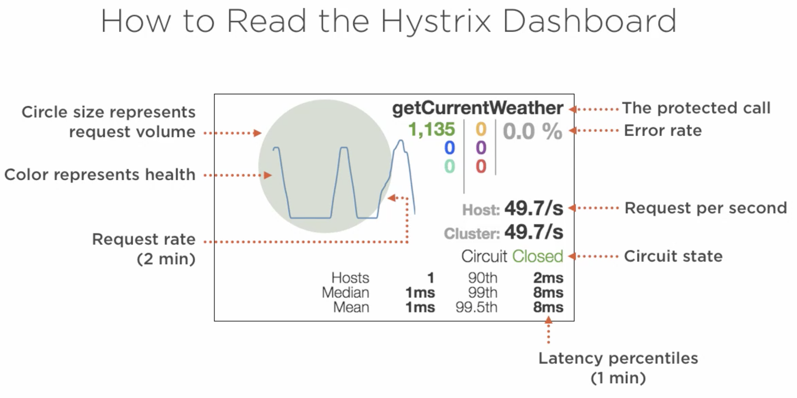
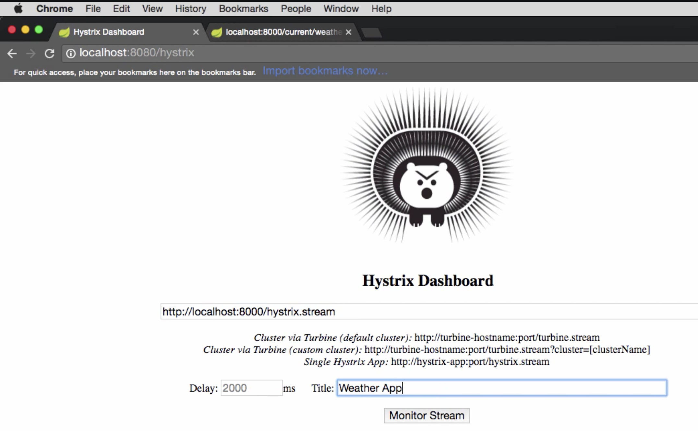

# Self Healing Services

Covers:

- Fault Tolerance
- Self-healing

## Failures in Distributed Systems

> "Failures are Inevitable”

Few areas where failures can occur

- hardware fails
- software fails
- network fails

> Chance of failure becomes "multiplied" in Distributed systems

### Cascading Failures

> "... a failure in a system of interconnected parts in which a failure of a part can trigger the failure of successive parts"
> \- Wikipedia

Multiple issues due to cascading failures:

- fault tolerance problem
- resource overloading problem

Solutions:

- Learn to embrace failures:
  - Tolerate failures
  - Gracefully degrade : examples are, empty/null/dummy response instead of failure.
- Limit resource consumed
  - Constrain usage : put limited resources and not allowing requests stacking up.

#### Circuit Breaker Pattern

> "... a design pattern in modern software development used to detect failures and encapsulates logic of preventing a failure to reoccur constantly ..."
> \- Wikipedia

## Netflix Hystrix

Hystrix is a latency and __fault tolerance__ library designed to stop __cascading failure__ and enable resilience in complex distributed systems __where failure is inevitable__.

Implements the circuit breaker pattern:

- Wraps calls and watches for failures
  - __10 sec rolling window__ : Detects failures within a “10 sec rolling window”
  - __20 request volume__ : Request should be at least 20 requests
  - __\>= 50% error rate__ : Circuit tripped when >= 50% are errors in a rolling window
- __Waits & tries a single request after 5 sec__ : Waits and tries a single request every 5 sec and determines whether to close the circuit
- __Fallbacks__ : Short-circuited, timed-out, rejected or failed requests results in “fallbacks”

Protects services from being overloaded:

- __Thread pools, semaphores, & cascading failures__ : If no resource is available (in threadpool) all the subsequent requests fail immediately with a fallback

### Using Spring cloud + Netflix Hystrix

`Application.java`

```java
@SpringBootApplication
@EnableCircuitBreaker // <----
public class Application {
    public static void main(String args...) {
        SpringApplication.run(Application.class, args);
    }
}
```

`Service.java`

```java
@Service
public class Service {
    @HystrixCommand(fallbackMethod = "somethingElse")
    public void doSomething() {
        // ...
    }

    public void somethingElse() {
        // ...
    }
}
```

__NOTEs:__

- If you want hystrix metric as well, add spring-boot-actuator dependency as well.
- Be careful with Hystrix timeouts:
  - Ensure timeouts encompass caller timeouts plus any retries
  - Default: `1000ms`
  - `hystrix.command.default.execution.isolation.thread.timeoutInMilliseconds=<timeout_ms>`

### Hystrix Dashboard

Tracks metrics such as:

- Circuit state
- Error rate
- Traffic volume
- Successful requests
- Rejected requests
- Timeouts
- Latency percentiles

Monitor protected calls:

- Single server or cluster

To use is, just add a dependency and add an annotation:

```java
@SpringBootApplication
@EnableHystrixDashboard // <----
public class Application {
    public static void main(String args...) {
        SpringApplication.run(Application.class, args);
    }
}
```

### Reading Hystrix Dashboard





- Start a standalone hystrix server (just like standalone discovery server)
- Put a server’s / `hystrix.stream` endpoint
- Give a name

## Netflix Turbine

> "Turbine is a tool for aggregating streams of Server-Sent Event (SSE) JSON data into a single stream..."

Why?

- Hystrix stream is for a service
- To track multiple services, we need to open multiple dashboards and track them independently.

### Using Spring cloud + Netflix Turbine

`Application.java`

```java
@SpringBootApplication
@EnableTurbine
public class Application {
    public static void main(String args...) {
        SpringApplication.run(Application.class, args);
    }
}
```

`application.properties`

```properties
turbine.app-configs=<list_of_service_ids>
turbine.cluster-name-expression='default'
```

OR `application.yml`

```yaml
turbine:
  appConfig: <list_of_service_ids>
  clusterNameExpression: "'default'"
```
