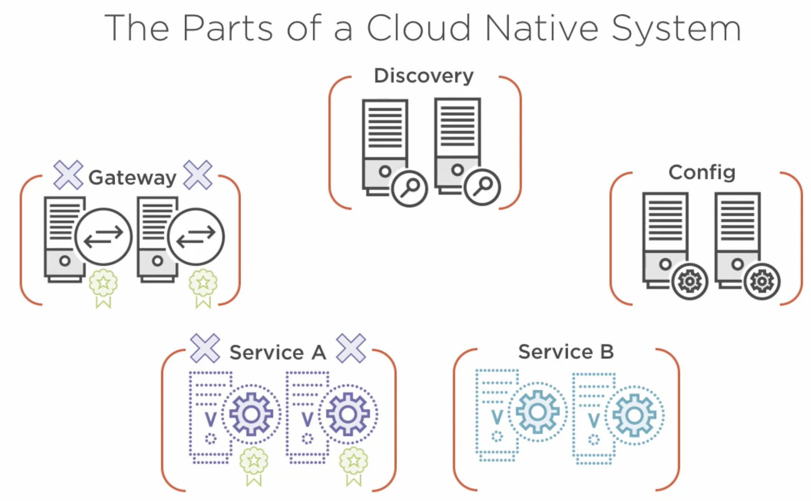
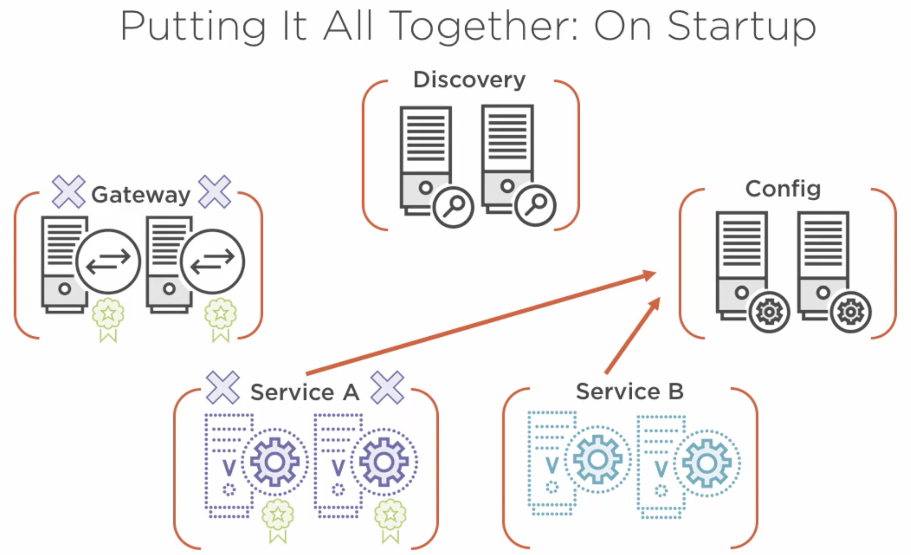
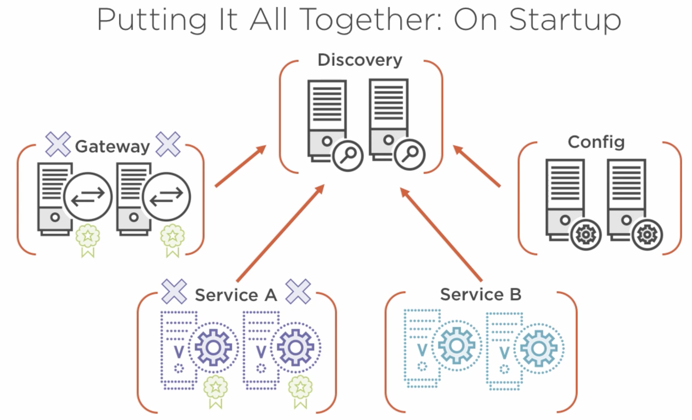

# Wrap - Big Picture

On Request (example to service A):

1. Request starts with the gateway (Zuul)
2. Gateway utilises already cached location of services A <> or asks Discovery server for Service A’s location.
3. Makes “hystrix-protected” call to service A.
4. Service A’s Response depends upon Service B, then same (if location cached then use it otherwise ask Discovery Server for it).
5. Makes “hystrix-protected” call to Service B.
6. Service B responds -> Service A responds -> Gateway Responds.

> There are other Spring Cloud projects as well (apart from the Netflix projects) e.g., Spring Cloud Bus, etc
