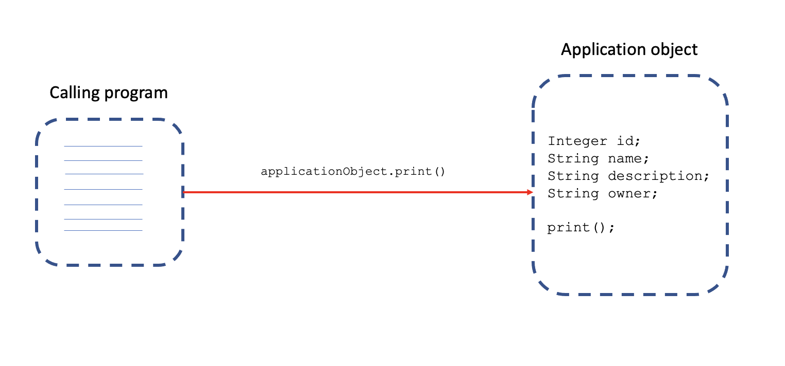
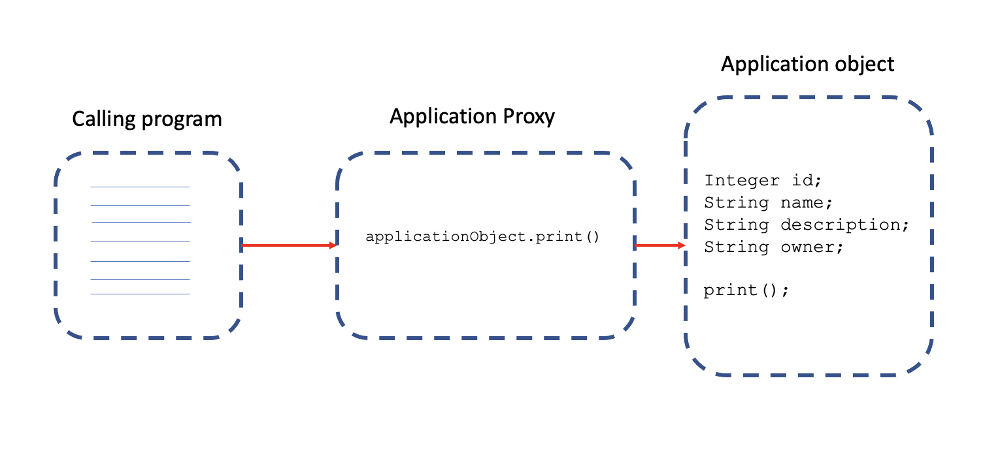

# Data Transactions with Spring

## Transaction

Multiple actions performed as a single group

### ACID Transactions

- __A (Atomicity):__ All or nothing (no partial).
- __C (Consistency):__ Committed (written) when all actions (in a transaction) are completed.
- __I (Isolation):__ Each transaction is isolated from other transactions, meaning uncorrupted data.
- __D (Durability):__ Cannot be deleted/undone by a system failure.

### Transaction Types

- __Global:__ Multiple resources manage the transaction. Usually managed by the web server.
- __Local:__ One resource manages the transaction. e.g., JDBC connection.

## Spring Framework

Consistent programming model across global and local transactions.

### Spring Transaction management types

#### Programmatic

- Custom code for transaction management.

Example:

```java
public void saveTicket(Ticket ticket) {
  Session session = SessionFactory.getCurrentSession();
  session.getTransaction().begin();   //--
  session.save(ticket);               //  | <=== transaction
  session.getTransaction().end();     //--
}
```

#### Declarative

- Manages transaction using Spring-specific annotations.
- Separates transaction management from business code.

Example:

```java
@Transactional
public void scheduleRelease(Ticket ticket, Release release) {
  ticketDao.saveTicket(ticket);
  assignToRelease(ticket, release);
  doOtherStuff(ticket);
}
```

Manages everything:

1. Begin
2. Suspend
3. Commit
4. Rollback
5. Transactional parameters

### Transaction Managers

__Programmatic Transaction Management:__

1. __Transaction template:__ Similar to Spring templates like `JdbcTemplate` and other available templates.
2. __Platform transaction manager:__ Handles transactions across Hibernate, JDBC, JPA, JMS, etc.

__Spring Transaction Managers:__

1. Platform transaction manager
2. JTA
3. Hibernate
4. DataSource
5. __JPA__

### `@Transactional` annotation

- Proxy is created to hold transaction management code.
- Annotation used at the class, interface or method level.
- Transaction propagation is handled automatically.

__NOTE:__ In Spring boot, it works without configuration.

### Spring Configuration

- JPA Transaction Manager: Registers a transaction manager for us.
- Additional configuration: Datasource, entity manager, repositories.
- Spring Data Repositories.

### Lifecycle and Scope

#### Database Transaction

__`@Transactional`__ defines a single transaction, in the scope of a __persistence context__.

#### Persistence Context

- Defined in __JPA__
- Handles a set of entities that contain data to be persisted.

### How `@Transactional` works?

Via proxies!

__Without proxy implementation:__



__With Proxy implementation:__



#### Proxy

- __Transaction Interceptor:__ Intercepts method calls.
- __Platform transaction manager:__ Handles transactions.

Difference proxies in Spring (JPA?) transaction handling:

1. __Persistence context proxy__
2. __Entity manager proxy__
3. __Transaction aspect__
4. __Transaction manager__

### Rollbacks

Rollbacks will occur for `RuntimeException` or unchecked-exception only.

- Use __`@Transactional(rollbackFor=Exception.class)`__ to state otherwise.
- Use __`@Transactional(noRollbackFor=SpecificException.class)`__ to avoid rollback on a specific exception.

Rollback will happen in case of:

1. Throw an exception from code.
2. Spring catches an unhandled exception.
3. Spring determines to mark the transaction for "rollback".

__NOTE:__

To enable the transaction logging from Spring, set: `logging.level.org.springframework.transaction.interceptor=TRACE`

### Transaction management code

Configuration:

```java
private final TransactionTemplate transactionTemplate;

// constructor
public ReleaseService(PlatformTransactionManager transactionManager) {
  this.transactionTemplate = new TransactionTemplate(transactionManager);
  this.transactionTemplate.setPropagationBehaviorName("PROPAGATION_REQUIRES_NEW");
  this.transactionTemplate.setReadOnly(true);
}
```

A simple 2 step transaction with the above configuration:

```java
transactionTemplate.execute(new TransactionCallbackWithoutResult() {
  public void doInTransactionWithoutResult(TransactionStatus status) {
    try {

    } catch (NoSuchElementException exception) {
      exception.printStackTrace();
      status.setRollbackOnly();
    }
  }
});
```

Fine-grained control in programmatic transaction management, using platform transaction manager directly.

```java
public Release scheduleRelease(Release release) {
  TransactionDefinition transactionDefinition = new DefaultTransactionDefinition();
  TransactionStatus transactionStatus = transactionManager.getTransaction(transactionDefinition);

  try {
    createTickets(release);
    assignTicketsToRelease(release.getId(), release.getTickets());

    transactionManager.commit(transactionStatus);
  } catch (RuntimeException e) {
    transactionManager.rollback(transactionStatus);
    throw e;
  }

  return release;
}
```

#### Declarative transaction management (vs Programmatic)

- Manage transaction via configuration.
- Separate transaction logic from business logic.
- Easy to maintain.
- Preferred when a lot of transaction logic.
