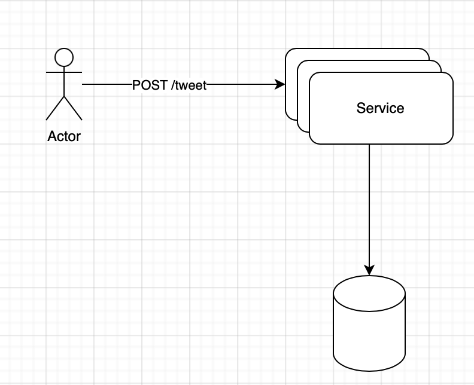
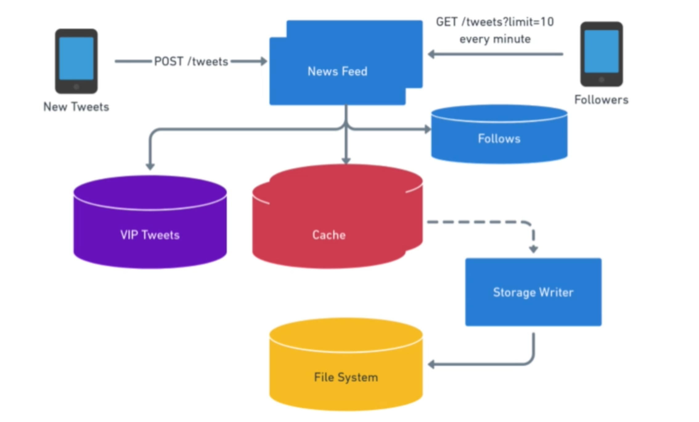

# Pragmatic System Design - Twitter

Or Any News Feed System

Basic Requirements:

- User should be able to post/tweet.
- Feeds of all the followers should get the post/tweet.

## Questions

- How many tweets per sec? => __10K per sec__
- Read to write ratio? => __30:1__
- Average number of followers per user? => __100 followers / user__
- Max number of follower a user has? => __1M max__

## Basic Design

- Load balanced servers with a single database
- __Tweets table__ [ user_id, tweet, timestamp ] and __followers table__ [ source, target ]
- POST API to create a tweet
- 10K writes per second can be handled by a fairly large DB and proper buffering strategies
- __300K reads per sec__ => __single DB cannot handle__

## Storage

- 100 bytes per tweet (assumption)
- 10K tweets per second => 86 GB per day => __31 TB per year__

## Scaling Reads

- Distributed cache

## Long-Term vs Short-Term Storage

- Cache and then archival to file system

## Feed Optimizations

## VIPs

## Additional Notes and Optimizations

### Users Segmentation

- Famous (huge followers)
- Active (active in past X days)
- Live (subset of active who are online) - real-time updates
- Passive (not active)
- Inactive (deleted)

Points:

- To implement read-heavy system, 2 ways:
  - pre-compute
  - cache information
- 3 different sub-system or scope of discussion:
  - Tweet
  - Follow
  - search
