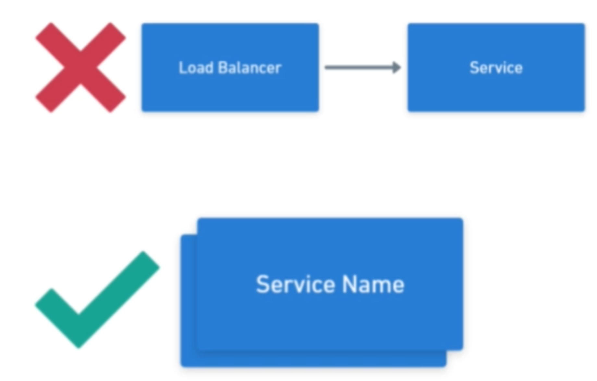
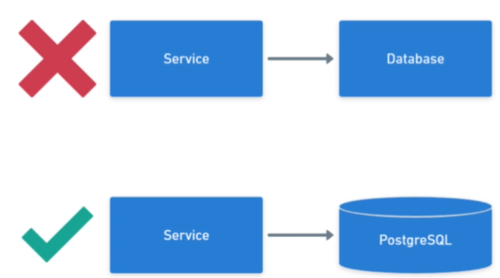
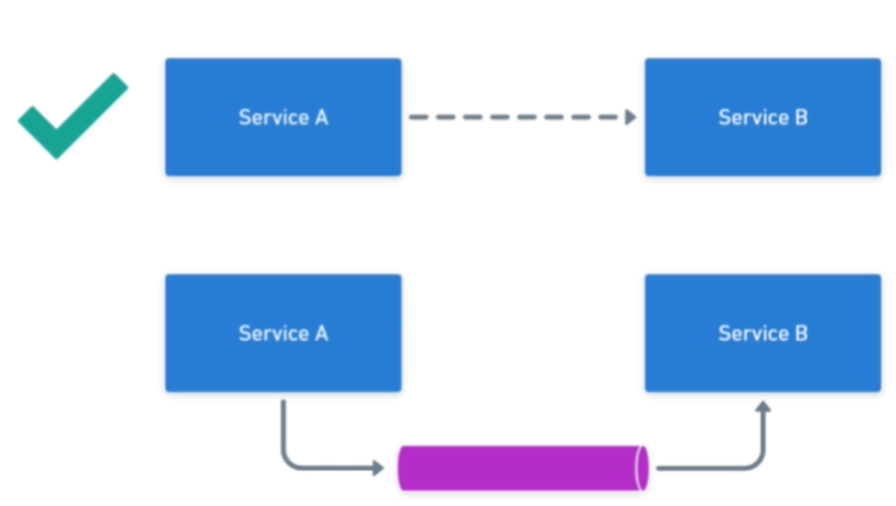

# Pragmatic System Design

## Diagrams

### Service

Blocks with a name

### LB

- Always associated with a Service
- Overlapping Service blocks

### Database

- Vertical Cylinder with Technology
- Don't use blocks (like service)

### Synchronous API

Solid lines with name/path/API (e.g., REST)

### Queues

- Way-1 horizontal cylinder connecting services
- Way-2 (prefer/simpler) Dashed Lines

### Users

- Don't use blocks (will confuse with service)
- Outside great network divider (vertical dashed lines)

## Diagram Flow

- Maintain Direction - data should flow only in single direction
- Alignment of components
- Avoid intersection of lines

## Making Estimates

- Throughput
- Latency
- DB Sizes

### Latency Number Estimates

| Estimated Latency | Operation |
|-|-|
| 1ns | Smallest unit - __L1 Cache Reference__ |
| 3ns | Branch Mis-predict |
| 4ns | __L2 Cache reference__ |
| 17ns | __Mutex lock/unlock__ |
| 31ns | __Sending 2000 bytes over commodity network__ |
| --   | -- |
| 2000ns = 2us | __Reading 1,000,000 bytes sequentially from memory__ |
| 16us | __SSD random read__ |
| 500us | __Round trip in same data center__ |
| 39,000ns = 39us | __Reading 1,000,000 bytes sequentially from SSD__ |
| -- | -- |
| 718,000ns = 718us | __Reading 1,000,000 bytes sequentially from disk__ |
| 2,000,000ns = 2ms | __Disk seek__ |
| 150,000,000ns = 150ms | __Packet roundtrip CA to Netherlands__ |

### Throughput Estimates

| Component | reads/sec | writes/sec |
|-|-|-|
| __RDBMS__ | 10k | 5k |
| __Distributed cache__ | 100k | 100k |
| __Message Queue__ | 100k | 100k |
| __NoSQL__ | 20k-50k | 10k-25k |

### Capacity Estimates

| DB | Size Estimate |
|-|-|
| __RDBMS__ | 3TB |
| __Distributed Cache__ | 16GB-128GB |
| __NoSQL__ | "Depends" |

## Component - Load Balancer

### Strategies

- Round Robin
- Least connections
- Resource based
- Weighted variants of the above
- Random

### Types of LBs

- Layer 4
  - Transport layer
  - Has access to : TCP or UDP, IP, Port
- Layer 7
  - Application layer
  - Has access to everything Layer 4 has access to.
  - In addition, has access to HTTP header, payload and cookies.

## Component - CDN

Content Delivery Network

- Geo location - physical problem that signal has to travel more.
- Expensive solution : globally distributed servers
- Actual solution : CDN
- Static content - images, css, html, JS

### CDN Types

- __Push__
  - We push for content upload / change
  - Infrequent updates
  - Smaller content
  - Eager
- __Pull__
  - Lazy
  - Slow for first access!

## Component - Distributed Cache

### Caching Strategies

__Cache Aside:__

- Checks Cache First, If cache miss, get data from DB, update cache and retrieve
- Cache misses are expensive
- Direct access to DB

__Read Through:__

- Doesn't have direct access to DB
- Rest strategy is same as previous
- Single API to talk to
- Cache misses are expensive

__Write Through:__

- Data Never Stale
- Updates are made to cache first and then to DB
- Writes are expensive
- Single API to talk to
- Unnecessary writes to cache (maybe no-one reads)

__Write Behind:__

- Write to cache first, waits for a timeout before flashing it to DB
- Cache acts as a buffer
- No write penalty
- Reduced load on DB (batched / latest update periodically)
- Lack of consistency
- Reliability (crashes create stale data in DB)

Cache Eviction Policies

- LRU
- LFU
- …

### Redis

- Distributed KV cache
- 100K reads/writes per sec per node
- Only Limited by RAM
- Keys : String
- Supports Values : string, list, set, hash etc.
- No support for nested data types : JSON etc.
- TTL (time to live for each key)
- Persistence (save data to disk) -> crash recovery (only every second)

## Component - Queue

- Async, no-wait, non-blocking
- Producer / Consumer

### Queue Modes

__Message Queue:__

- Actions
- Exactly once delivery
- Maybe Out of order
- Retries

__Pub/Sub:__

- Notification
- At-least once delivery
- Always in order
- No - retries

### RabbitMQ

- AMQP protocol
- Stores message until one of the consumer receives it
- Offload heavy tasks
- Routing key
- Exchange
  - Direct - round robin message dispatcher
  - Topic / header - sharded based on topic name or header
  - Fan-out - broadcast (pub/sub mode)
- Concurrency though channels
- Reliability through acknowledgements

### Kafka

- Even stream platform
- Pub/sub
- Messages are stored for a certain period of time
- Topics
- Evens : keys, values, timestamp
- Partitions
- Consumers subscribe to partitions (may subscribe to multiple partitions)
- More partitions -> more latency / more throughput
- Consumer groups -> all consumer group gets the message once
- Consumer offsets (in partitions) -> consumers increments the offset (in partitions), consumer crash resilient
- Producers always appends
- Slow consumers don't affect queue performance
- Very high throughput 100k+ messages per sec

## Protocol - TCP

Transport control protocol - layer 4

__Backbone of:__

- __WebSockets__
- __HTTP__
  - REST
  - gRPC
  - GraphQL

__Pros:__

- __Reliable__ - expects confirmation of ack from receiver
- __Ordered__ - numbers the packets
- __Error-checked__ - retries

__Cons:__

- Can be slow

## Protocol - UDP

Datagram protocol, complete opposite of TCP

- Fast because it does less work - "general trade-off"

__Typical Usages:__ Where there is a stream of data, when we can afford to miss some packets (as they will keep coming).

- Monitoring metrics
- Video streaming
- Gaming
- Stock exchange

## Protocol - HTTP

- Hypertext (text with links to other documents) Transfer Protocol
- Based on TCP
- Request-Response protocol
- Layer-7 - Application layer

### RESTful URLs

__METHOD /[resource/id]__

- resource name should be plural and a noun `/users/567/` and not `/user/567/`
- action suffix be used to update state - should be idempotent operations! `/users/537/enable`
- GET shouldn't change entity in any way
- PUT should be idempotent!
- query params can be used of pagination

## Protocol - Websocket

- Built on top of HTTP
- Duplex
- Persistent connection
- Best used to avoid polling solutions in REST.

__Cons:__

- Need to reinvent REST, no standard yet
- Load balancers may have some trouble
- More complicated to implement than HTTP

## Protocol - Long Polling

Instead of frequent (is there anything new?) calls, there is a long call until response arrives.

- Close connection as soon as we get the response/message
- Not exactly a protocol, it just uses long lived HTTP calls.
- Hard to keep connections open in some frameworks (controlled internally)
- Consumes lot of resources (too many live threads)

## Protocol - RPC

- Invoke other services as if they were a local function
- Function is described in an abstract language - IDL (Interface description language)
- A Generator takes description as an input and creates specific implementation in a particular language.

### gRPC

- Developed by Google
- Uses protobuf as IDL
  - Binary
  - Not human readable
  - Smaller / faster than JSON or XML
- Uses HTTP/2 as transport
- Creates stubs for functions of remote call using a generator

__Con:__

- Cannot be use in browsers

## Protocol(?) - GraphQL

- Prevents over fetching and under fetching
- Query Language developed by Facebook
- Based on HTTP
- Request and Response are in JSON format
- Lets you define which fields and nested entities to return
- GET -> Query
- POST/PUT/DELETE -> Mutation

## Protocol - Questions Need to Ask First

1. External API?
2. Bi-directional?
3. High throughput?
4. Web browser support?

| Protocol | External API | Bi-directional | High throughput | Web browser support |
|-|-|-|-|-|
| REST          | [x] |     |     | [x] |
| WebSocket     | [x] | [x] | [x] | [x] |
| gRPC          |     |     | [x] |     |
| GraphQL       | [x] |     |     | [x] |
| UDP           | [x] | [x] | [x] |     |
| Long Polling  | [x] | [ ] |     | [x] |

## Misc Concepts - Processes

- Each process has separate memory space

## Misc Concepts - IPC

- File -> can be slow and sometime hard to do it right.
- Signal -> sending only a number
- Socket
  - Network sockets -> remote connection possible
  - Unix Domain Sockets -> faster but limited to current machine
- Pipe -> connecting std-out of one process to the std-in of another
- Shared memory
- Message passing

## Misc Concepts - Threads

- Every process has a memory
- Thread have their own "stack" space
- Rest of the process memory will become "heap" space, which is shared between all the threads within the process
- In Java a thread is given 1MB of memory by default, there can be a memory limit
- OS can limit new thread creation
- Spawning a new thread is slow
- More threads will create contention among them

## Misc Concepts - Database Indexes

### B-Tree+

- All the values in the leaves
- Parent Nodes just hold the range
- + means that each leaf node is also connected to aid the range queries as all the values are ordered.

## Misc Concepts - Database Sharding

### Tenant Based Sharding

- Easy to reason about
- Easy to add new shards
- Uneven shards
- Some types of systems have no good way to separate entities

### Hash Based Sharding

- Even distribution
- Works well of K-V data
- Harder to add new shards
- Weaker consistency (no foreign key)

Shard lookup service / sharding router helps

- Can be a single point of failure
- Simplifies adding new shards
- Cross shard operations are expensive
- "Avoid sharding" - very complicated

## Misc Concepts - Consistent Hashing

- Solves the Re-Sharding problem arises while adding/removing shards

## Misc Concepts - Partitioning

- Different than Sharding
- Split tables instead of entire databases
  - Smaller files -> faster queries
  - Smaller indexes can fit into memory
  - Dropping partitions is fast
- Hard to maintain uniqueness

## Misc Concepts - CAP Theorem

- Pick "two" is wrong!
- Right : Consistency or Availability
- Availability - means "no failures" and success on each request/write
- Consistency - means all nodes have same data
- Mostly about NoSQL
- Mostly about writes

## Misc Concepts - ACID transactions

| | Summary | Trade-Off |
|-|-|-|
| __Atomicity__ | Everything or Nothing | Memory consumption |
| __Consistency__ | All the validations are executed | CPU consumption, IO |
| __Isolation__ | Nothing is seen by other users until commit | Memory, CPU consumption, IO |
| __Durability__ | Everything is saved to Disk on commit | IO |
